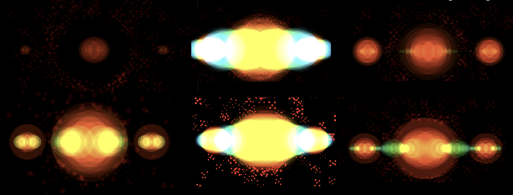
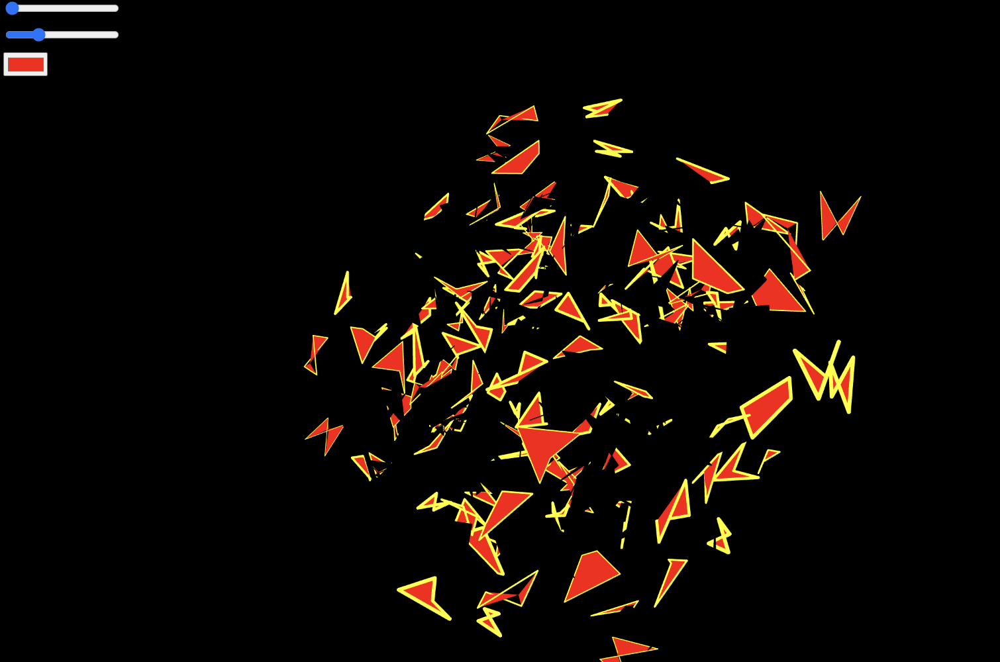
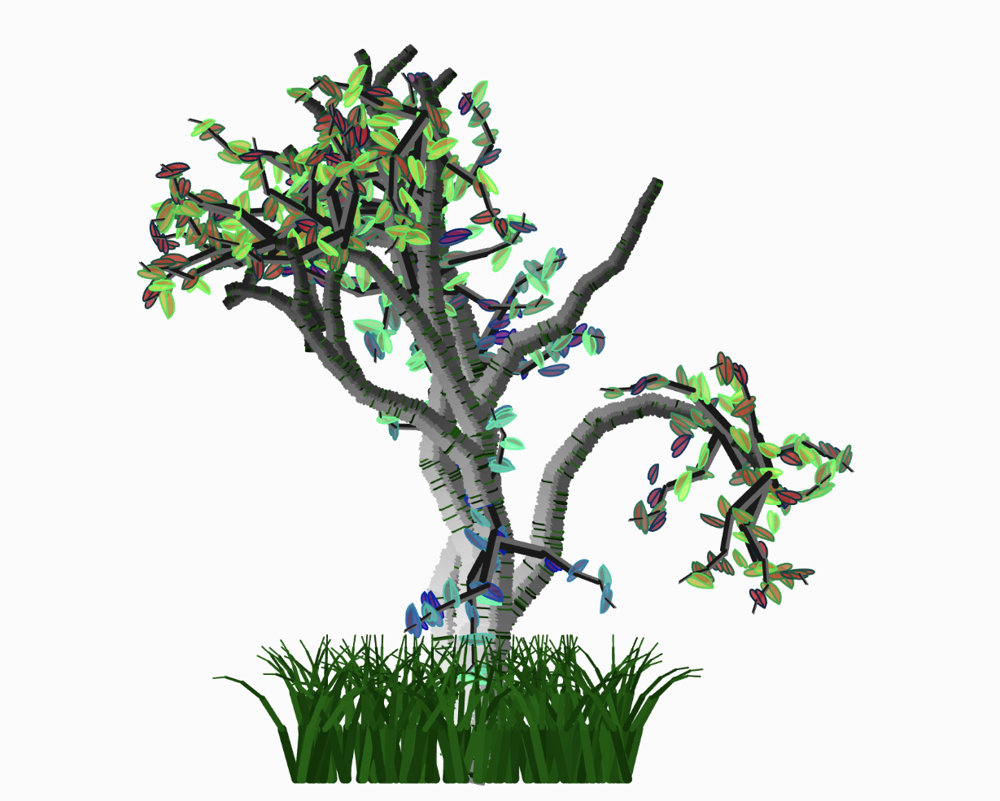
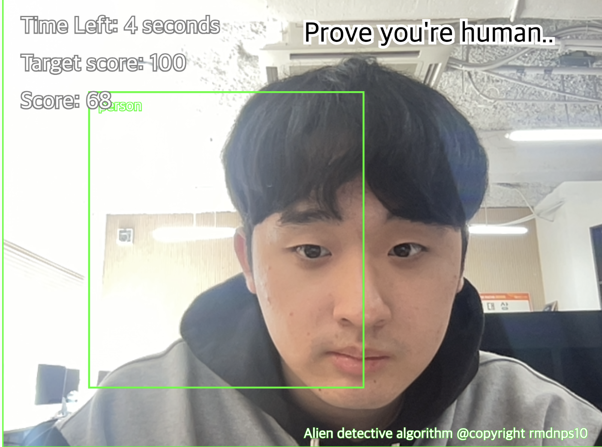
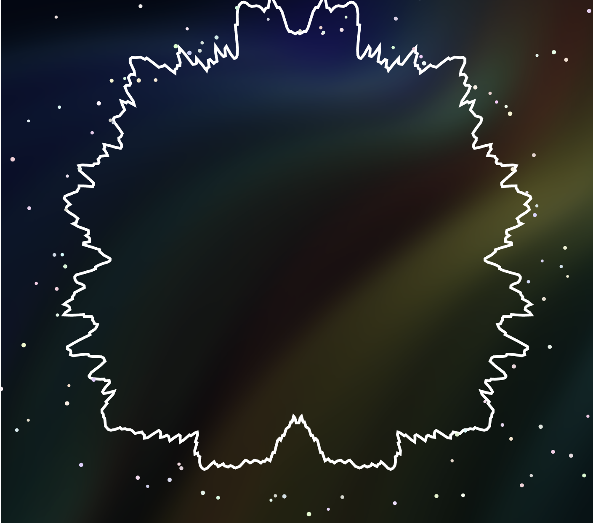

# Processing Archive

Sogang University A&T 20 Inyoung Chung

--- 

### Red sun 

[p5link](https://editor.p5js.org/rmdnps10/sketches/GO9eLTtDE)

Audio data mapping & visualization

- Visualization of the frequency and spectrum of audio data.
- Audio data is from Show Me the Money hip-hop song,  ‘red sun’ by 행주.

---

### Electronic Magetic Field

[p5link](https://editor.p5js.org/rmdnps10/sketches/9NCmgClhr)

Generative Design System

- Revolving electronic fields were implemented in 3D environment (WEBGL) by creating polygons using Bezier curves.
- You can customize the color and rotation speed of the electric magnetic field by using slider.

---

### Planting Tree in the City

[p5Link](https://editor.p5js.org/rmdnps10/sketches/2YKfRS5fb)

Collage work

- If you click the screen, tree generates at the coordinate in the middle of the Seoul.
- The message I want to convey is hidden in the work.

---

### Recursive Birch Tree Generator

[p5Link](https://editor.p5js.org/rmdnps10/sketches/xBod-ihS9)

- When you run the code, a birch tree of a different shape is created each time recursively.
- Detailed Descriptipn (texture, leaves) is performed by using vector.

---

### Tragic of War

[p5Link](https://editor.p5js.org/rmdnps10/sketches/mcG2dzSXW)

---

### Alien detective algorithm

[p5Link](https://editor.p5js.org/rmdnps10/sketches/WDcQzZWnd)

- using javascript machine learning library YOLO
- You have to be recognized as a person by YOLO and exceed the target score within a certain time. 

---

### Music Reactor

[p5Link](https://editor.p5js.org/rmdnps10/sketches/-oGeTIphM)

- When you click, the geometric shape changes according to the waveform of the music being played.
- The waveform information obtained through the FFT library was mapped to a shape.

---

### Running ladybug

[p5Link](https://editor.p5js.org/rmdnps10/sketches/lhDJCPYIT)

Adorable ladybug

